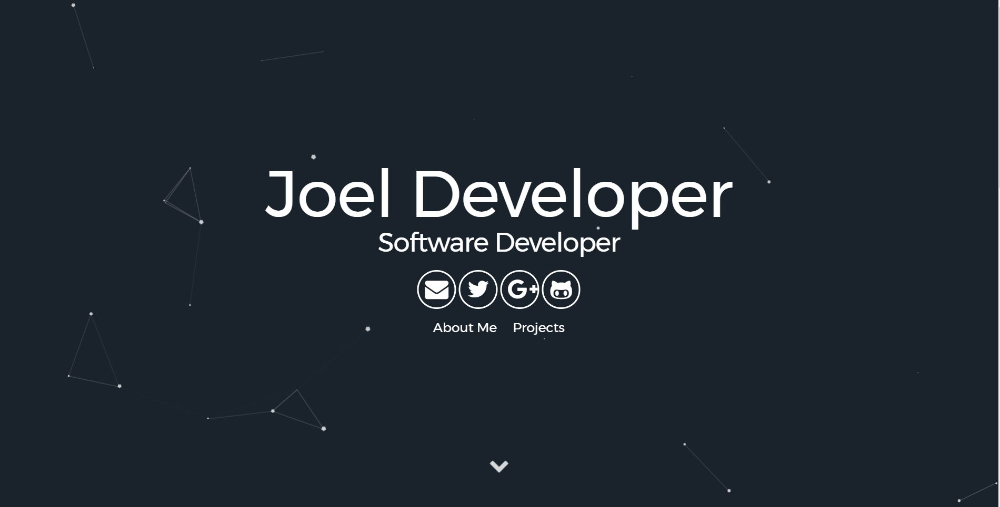

# Particle Jekyll Theme




The Theme features:

- Gulp
- SASS
- Sweet Scroll
- Particle.js
- BrowserSync
- Font Awesome and Devicon icons
- Google Analytics
- Info Customization

## Basic Setup

1. [Install Jekyll](http://jekyllrb.com)
2. Fork the [Particle Theme](https://github.com/nrandecker/particle/fork)
3. Clone the repo you just forked.
4. Edit `_config.yml` to personalize your site.

## Git Bash

You have to fill some informations on `_config.yml` to customize your site.

```
git status
 - 새로 만들어진 파일, 수정된 파일, 삭제된 파일이 있을 경우 붉은색 글자로 파일의 상태를 보여준다..
git add *
 - 새로만들어진 파일을 커밋할 수 있게 바꿔준다.
git status
 - 파일을 커밋할 수 있다는 의미의 초록색으로 파일명이 바뀐다.
git commit -m "커밋메시지"
 - 메시지는 꼭 입력.
git remote -v
 - 현재 리모트 저장소를 확인.
git push

```


## Color and Particle Customization
- Color Customization
  - Edit the sass variables
- Particle Customization
  - Edit the json data in particle function in app.js
  - Refer to [Particle.js](https://github.com/VincentGarreau/particles.js/) for help

## Running the blog in local

In order to compile the assets and run Jekyll on local you need to follow those steps:

- Install [NodeJS](https://nodejs.org/)
- Run `npm install`
- Run `gulp`

## Haroopad
http://pad.haroopress.com/
- 마크다운 편집 툴
- User > OS Image

## Questions

Having any issues file a [GitHub Issue](https://github.com/joelweon/joelweon.github.io/issues).

