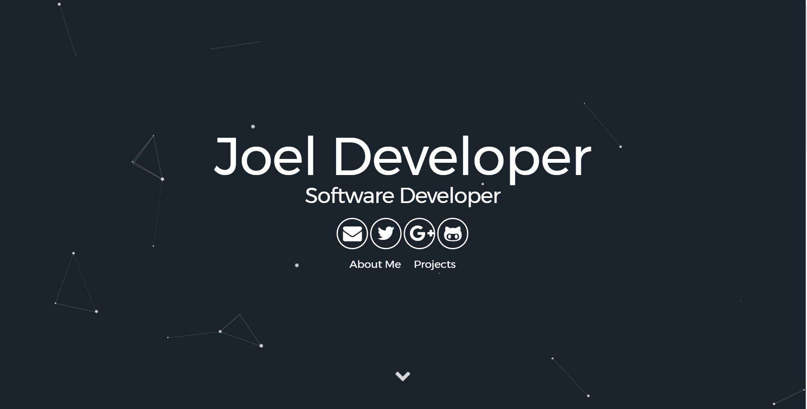

# Particle Jekyll Theme




The Theme features:

- Gulp
- SASS
- Sweet Scroll
- Particle.js
- BrowserSync
- Font Awesome and Devicon icons
- Google Analytics
- Info Customization

## Basic Setup

1. http://jekyllrb.com
2. Fork the https://github.com/nrandecker/particle/fork
3. Clone the repo you just forked.
4. Edit `_config.yml` to personalize your site.

## Git Bash

You have to fill some informations on `_config.yml` to customize your site.

```
git status
 - 새로 만들어진 파일, 수정된 파일, 삭제된 파일이 있을 경우 붉은색 글자로 파일의 상태를 보여준다..
git add *
 - 새로만들어진 파일을 커밋할 수 있게 바꿔준다.
git status
 - 파일을 커밋할 수 있다는 의미의 초록색으로 파일명이 바뀐다.
git commit -m "커밋메시지"
 - 메시지는 꼭 입력.
git remote -v
 - 현재 리모트 저장소를 확인.
git push

```


## Color and Particle Customization
- Color Customization
  - Edit the sass variables
- Particle Customization
  - Edit the json data in particle function in app.js
  - Refer to https://github.com/VincentGarreau/particles.js/ for help

## Running the blog in local

In order to compile the assets and run Jekyll on local you need to follow those steps:

- Install https://nodejs.org/
- Run `npm install`
- Run `gulp`

## Three.js Demo Gallery (`threejs-keyframes/` → `threejs/`)

`threejs-keyframes/` 는 **Vite 프로젝트(소스)** 이고, 빌드 결과는 리포 루트 `threejs/` 로 출력됩니다.
GitHub Pages 는 Vite 를 실행하지 않으므로, **빌드 산출물(`threejs/`)을 직접 커밋해야** 사이트에 반영됩니다.
(소스만 고치고 push 하면 라이브에 반영되지 않습니다.)

```bash
cd threejs-keyframes
pnpm install        # 최초 1회
pnpm build          # → 리포 루트 threejs/ 갱신
cd ..
git add threejs threejs-keyframes
git commit -m "..."
git push            # threejs/ 산출물까지 함께 push
```

- 패키지 매니저는 **pnpm** (npm/yarn 아님).
- 로컬 미리보기: `pnpm dev` (http://localhost:5173) / `pnpm preview` (http://localhost:4173/threejs/).
- 홈 화면 Project 영역의 인라인 갤러리는 `src/embed.js` → 고정 파일명 `threejs/embed.js` 로 빌드됩니다.

## Haroopad
http://pad.haroopress.com/
- 마크다운 편집 툴
- User > OS Image

## Questions

Having any issues file a https://github.com/joelweon/joelweon.github.io/issues.

